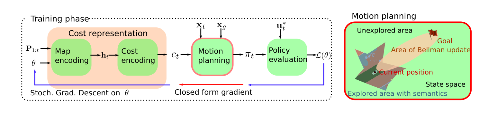
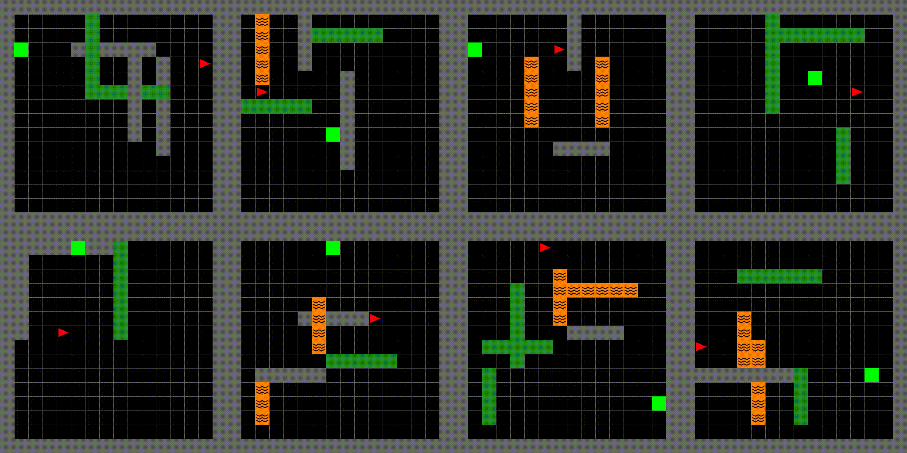
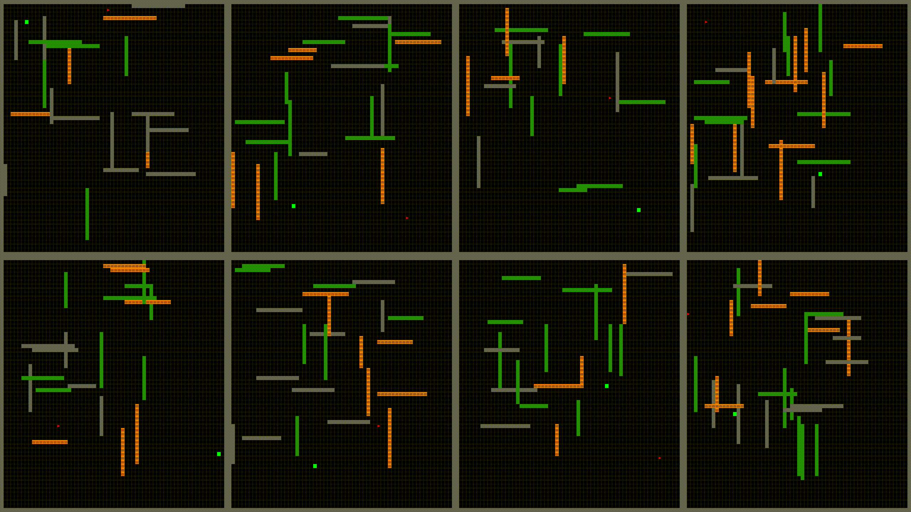

# Inverse reinforcement learning for autonomous navigation via differentiable semantic mapping and planning
[[Project page]](https://tianyudwang.github.io/sirl/) [[Paper]](https://arxiv.org/abs/2101.00186)




## Installation
We assume that the following commands are run in a python virtual environment.
1. Install gym-minigrid from this fork
```bash
git clone git@github.com:tianyudwang/Minigrid.git
cd Minigrid
pip install -e .
cd ..
```

2. Download pybind11
```bash
git clone git@github.com:pybind/pybind11.git
```

3. Build the A* c++ code
```bash
cd astar_cpp
mkdir build
cd build
cmake ..
make
```
Return to project page and link
```bash
cd ../..
export PYTHONPATH=./astar_cpp/lib:${PYTHONPATH}
```

4. Generate dataset
```bash
python3 scripts/expert_policy.py --grid_size 16
```
The generated trajectories are under `demonstration/` folder

5. Run training
```bash
python3 scripts/train.py --grid_size 16
```
The tensorboard logs with training metrics are in the `logs/` folder and can be opened with
```bash
tensorboard --logdir logs
```

6. Run testing
To run testing with pretrained models in the `trained_models/` folder
```bash
python3 scripts/test.py --grid_size 16
```
This shows the success rate of rolling out the trained policy at each state. 

Here are some visualizations of test episodes in 64 by 64 maps


## Bibtex
```
@article{Wang2021sirl,
         author = {Wang, Tianyu and Dhiman, Vikas and Atanasov, Nikolay},
         title = {Inverse Reinforcement Learning for Autonomous Navigation 
                  via Differentiable Semantic Mapping and Planning},
         journal={arXiv preprint arXiv:2101.00186},
         year={2021}
         }
```